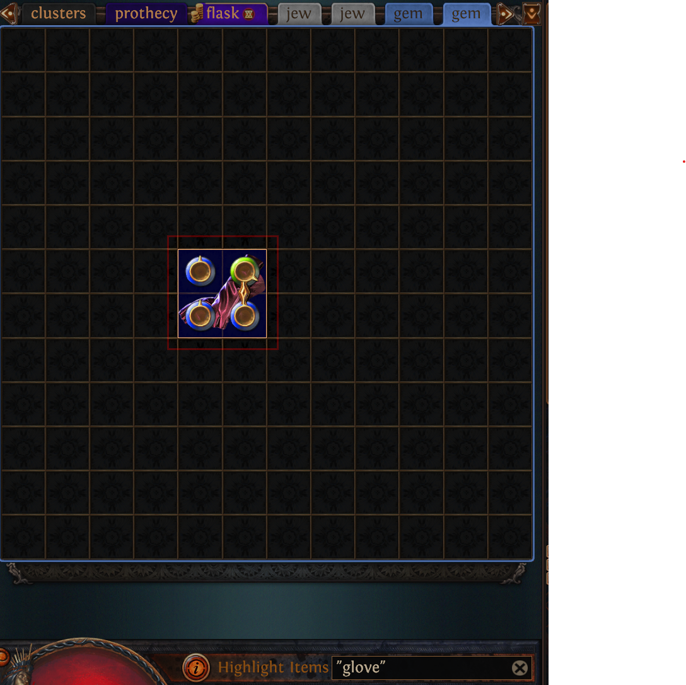
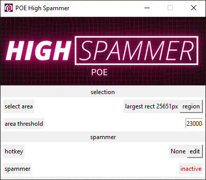

# POE High Spammer

## Step 1: Select target

1. In a stash-tab, place your target item.
2. In the "highlight items" search box, enter a filter which highlights the item (e.g. "glove").
3. switch to the spammer & press "region" to select a tight fit around the item in poe

## Step 2: Configure threshold

1. read the pixel value in "largest rec #px"
2. adjust area threshold to a slightly lower value

## Step 3: Set hotkey

Press the "edit" button and then any single key, that should toggle the tool, press "stop"..

## Step 4: Prepare for action

First adjust the filter in the "highlight items" search box to your target, be strict surround the query with quotes, and use the modifier name if possible.s

Once the hotkey is toggled the auto-clicker will simulate a mouse left click, until the item is highlighted.
For this it is important that the box which your item is within is not obscured by the info panel.
To ensure this doesnt happen hold the [ALT] key.
To repeatedly use currency hold the [SHIFT] key.

In this example we want to alt spam any life roll on our gloves, so we hold [SHIFT]+[ALT] and hover over the item, so that the cursor does not overlay the edge of the item-boundary-box (which is used for detecting the match).
Now press the hotkey [COLON].

The autoclicker will reroll until the item is highlighted. This also works with influenced/animated items.
