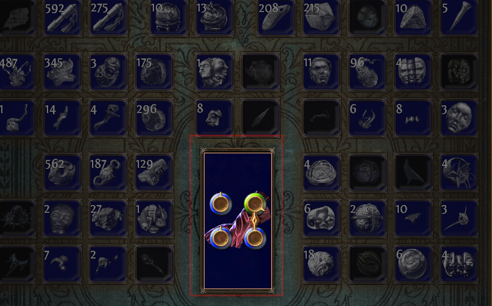
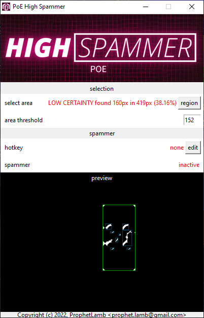

# PoE High Spammer

PoE High Spammer is a crafting tool for the game Path of Exile.
At its core it remaps the scroll wheel input to left clicks, a maximum of one action in game is taken per scroll action.

After each reroll ("spamming") the tool checks, if the current filter highlights the item. If so it prevents over-rolling the highlighted state even if the user continuously scrolls.

## Legality

The [terms of use](https://www.pathofexile.com/legal/terms-of-use-and-privacy-policy) section 7 restrict tool usage for the game. Many crafting tools such as auto-clickers are prohibited by section c:
> 7. Restrictions: Under no circumstances, without the prior written approval of Grinding Gear Games, may you:
> [...]
> c. Utilise any automated software or 'bots' in relation to your access or use of the Website, Materials or Services.

To circumvent this limitation it is common to remap left-click to the scroll-wheel to quickly move inventories. This method is [officially approved](https://www.reddit.com/r/pathofexile/comments/8y5cay/in_light_of_the_recent_build_of_the_week_video/) by the path of exile Support. Please note that this standpoint can change at any time.

> It seems that, to be fully "ethical" (i.e. no breaching of Terms of Service), you need to make sure you're using a mouse-wheel that doesn't spin on its own, i.e. 1 finger movement = 1 key-press.

> As for how to actually do it, it seems most commonly if you have a gaming mouse it should come with a control panel software that lets you rebind what mouse buttons do, but I don't think I have that personally, so you'd probably want to look into using AutoHotkey. As GGG tells us that anything that goes beyond 1 click or button-press = 1 server-side action is a ban-able offense, you shouldn't need to learn anything too sophisticated to set up a simple key rebind with AutoHotkey.

This tool uses the same method. We listen to mouse scrolls and count the number of scrolls. This queue of user-actions is then drained one-by-one, so that we have a maximum of one server-action per user-action.

## Detection method

To detect a highlighted item the tool applies filters to a specified screenshot region. The goal is to detect the bright border around a highlighted item using optical image recognition.

1. Take gray-scale screenshot.   

2. Apply thresholding to only "see" bright features.   

3. Apply closing with a cross kernel to the image, in order to compensate for minor "breaks" in shapes.   

4. Label major features in the image.      This image has the known feature coordinates rendered in green.

Now we simply calculate the area for the largest feature, which we assume is the box. In this case the area is 25651px^2, and compare it to the "area threshold" 23000px^2. If the area exceeds the threshold, then the box is highlighted.

Comparing the highlighted to the non highlighted item below, we can clearly see that the border is missing. Calculating the largest area we obtain 100px^2 which is far below the "area threshold".

## How to use

### Step 0: Start app

Install python, then install `scipy`, `numpy`, `pynput`, `pyautogui` using pip. Start the app (`python.exe ./main.py`).

Alternatively download a binary distribution of the application and install or launch that.

### Step 1: Select target

1. In a stash-tab, place your target item.
2. In the "highlight items" search box, enter a filter which highlights the item (e.g. "glove").
3. Switch to the PoE High Spammer & press "region" then select a tight fit around the item in PoE.

If the best fit fills less then 75% of the selection, then the tool warns the user. Such a state may cause issues when stopping rolling.

### Step 2: Configure threshold

| Note                                                           |
| -------------------------------------------------------------- |
| This is guessed automatically and doesnt need to be configured.   The value refers to the sqrt of the area. |

1. Read the `area` value in `"found {area}px in {selected}px ({ratio}%)"`.
2. Adjust area threshold to a slightly lower value.

### Step 3: Set hotkey

Press the "edit" button, followed by any single key that should toggle the tool. Finally press "stop".

### Step 4: Prepare for action

First adjust the filter in the "highlight items" search box to your target, be strict surround the query with quotes, and use the modifier name if possible.

Once the hotkey is toggled the spammer will simulate a mouse left click, until the item is highlighted.
For this it is important that the box which your item is within is not obscured by the info panel.
To ensure this doesn't happen hold the `[ALT]` key.
To repeatedly use currency hold the `[SHIFT]` key.

In this example we want to alt spam any life roll on our gloves, so we hold `[SHIFT]+[ALT]` and hover over the item, so that the cursor does not overlay the edge of the item-boundary-box (which is used for detecting the match).
Now press the hotkey `[COLON]`.

The spammer will reroll until the item is highlighted. This also works with influenced/animated items.
Action will only be taken once per scroll, so that the tool exhibits a maximum of 1 server action per 1 input.

### Dont's

#### Broken border

Ensure your cursor (, or the item on the cursor) do not obscure the bounding box while spamming. Consider setting the cursor size to small in the options.

